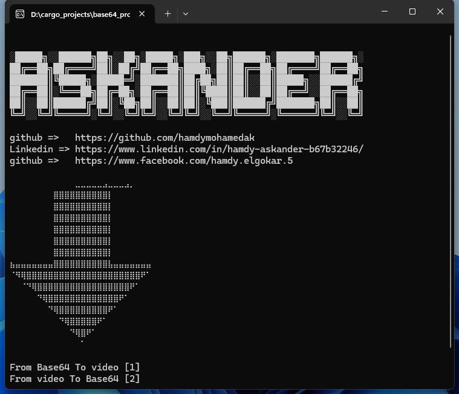

#  base64_project
 its a converter to convert videos to text
# usage
EXE file:
1-create a txt file you want to save the video data at it and select the file path from tool
if you want to convert txt file to video you should create a file have path mp4
# run project

## Screenshots

